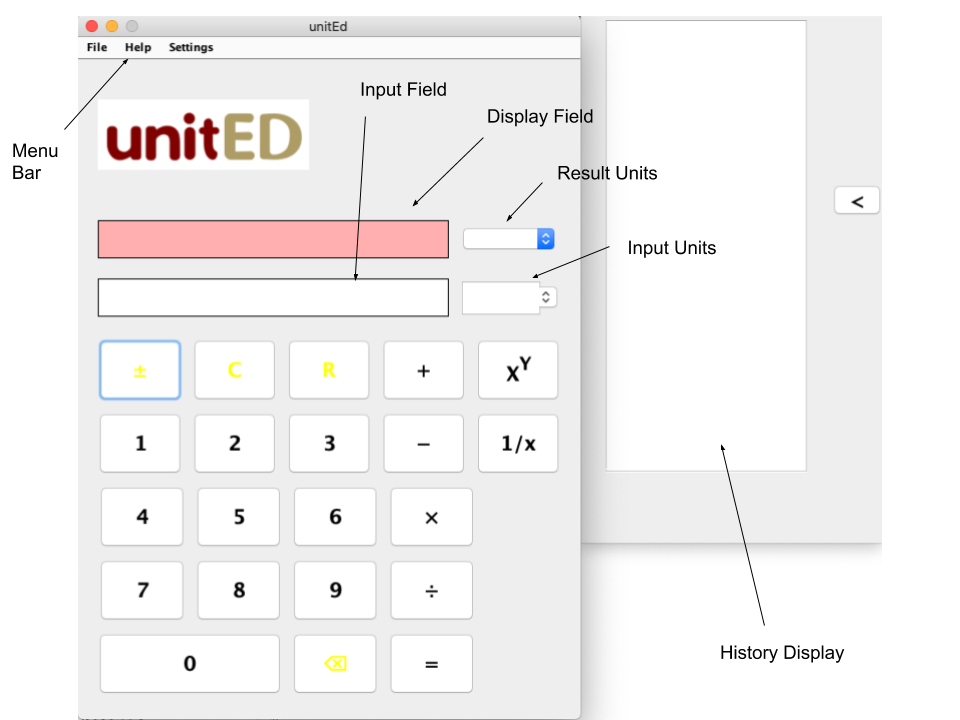
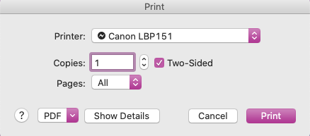
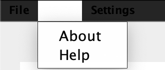
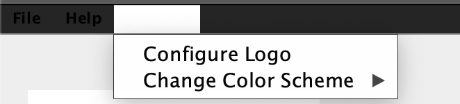
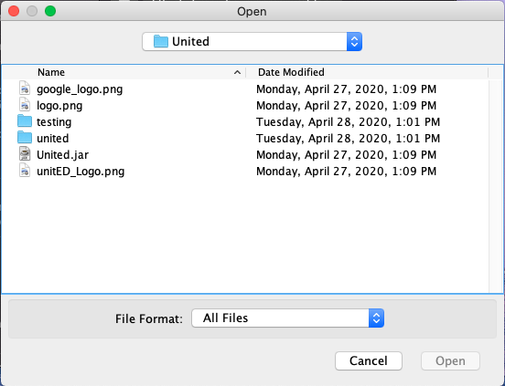
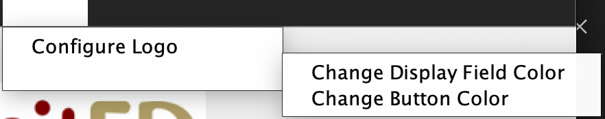
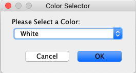
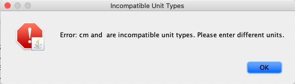

# UnitED Unit conversion calculator

## Description
United Unit conversion calculator

---

## Business Summary
1. Round attribute handles keeping track of teams’ progress in the tournament
2. Tables hold information regarding:
    * Games
    * Teams
    * Players
    * Points
    * Rebounds
    * Assists

---
## Business Rules
1. Every contest has exactly two teams
2. Every player has one team
3. Each contest has one winner
4. If a team loses they are eliminated and have no more games
5. A team’s rank does not change throughout all of the games
---


## Getting Started

### Dependencies
1. Download and install [Java](https://www.java.com/en/)
2. Download ```unitED-1.0.0.jar```

### Run the Program
* Double click ```unitED-1.0.0.jar``` then the calculator shows up, which should looks like:
<center>
    
</center>

---
## Menu Bar

### File
1. Clicking on ```File``` in the menu bar will present you with an option to ```Print```.
2. Clicking on ```Print``` will then open a window where you can choose the printer you would like to print from and change other settings about what is printed.
3. Once you are ready to print, click the highlighted ```Print``` button to print out the calculation history.

<center>
    
</center>

---

### Help
1. Clicking on ```Help``` in the menu bar will present you with two options: ```Help``` and ```About```. 
2. ```Help``` brings you to this page and gives helpful information about using the product.
3. ```About``` will pop open a window that gives about information for the product.

<center>
    
</center>

---

### Settings
* Clicking on ```Settings``` will present you with two options: ```Configure Logo``` and ```Change Color Scheme```.

<center>
    
</center>

#### Configure Logo
1. Selecting this option will open a file explorer where you can select a new image file to be used as a logo.
2. Once you have selected the new logo image file, click 'Open' to load the new file.

<center>
    
</center>

---

### Change Color Scheme
<center>
    
</center>

#### Change Display Field Color
1. Selecting this option will present two more options: 'Change Display Field Color' and 'Change Button Color'.
2. Selecting 'Change Display Field Color' will open a window with a drop down menu to choose a new color for the display field.
3. Once you have selected the new color you want for the display field, click 'OK' to apply the change.

<center>
    
</center>

#### Change Button Color
1. Selecting 'Change Button Color' open a window with a drop down menu to choose a new color of the buttons.
2. Once you have slected the new color you want for the buttons, click 'OK' to apply the change.

<center>
    
</center>

---

### Display and Input Field
#### Display Field
* This is where the resulting calculation appears. The resulting units will apear in the Result Units drop down. Within the drop down, you can see the other possible like-units that you can convert your calculated expression to.

#### Display Field
* This is where the resulting calculation appears. The resulting units will apear in the Result Units drop down. Within the drop down, you can see the other possible like-units that you can convert your calculated expression to.

#### NOTE: YOU CAN ONLY COMPUTE LIKE-UNITS
* Doing otherwise will result in an error and a dialog box will appear explaining the error. The error dialog box will look something like this:

<center>
    
</center>


---

### Buttons
* While most of the buttons on the calculator are standard, some may not be on every calculator or appear the same on every calculator.
1. \- 
    * This button will negate the current operand. (I.E. make a positve operand negative and make a negative operand positive)
2. 
#### Display Field
* This is where the resulting calculation appears. The resulting units will apear in the Result Units drop down. Within the drop down, you can see the other possible like-units that you can convert your calculated expression to.

#### NOTE: YOU CAN ONLY COMPUTE LIKE-UNITS
* Doing otherwise will result in an error and a dialog box will appear explaining the error. The error dialog box will look something like this:

<center>
    
</center>