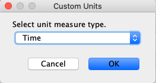
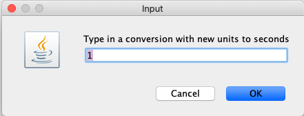

# UnitED Calculator

## Description
UnitED calculator is a Java-based unit conversion calculator, which allows users to perform numerical calculations and conversions between units. There are three buttons and seven secondary buttons on the Menu Bar. History allows users to see the calculated results, and File allows users to print out these calculation histories. Users can find the information page About and the help page Help in Help. If users want to change the color of the interface or buttons, Setting will help them.

---
## Getting Started

### Dependencies
1. Download and install [Java](https://www.java.com/en/)
2. Download ```unitED-1.0.0.jar```

### Run the Program
* Double click ```unitED-1.0.0.jar``` then the calculator shows up, which should looks like:
<center>
    
</center>

---
## Menu Bar

### File
1. Clicking on ```File``` in the menu bar will present you with an option to ```Print```.
2. Clicking on ```Print``` will then open a window where you can choose the printer you would like to print from and change other settings about what is printed.
3. Once you are ready to print, click the highlighted ```Print``` button to print out the calculation history.

<center>
    
</center>

---

### Help
1. Clicking on ```Help``` in the menu bar will present you with two options: ```Help``` and ```About```. 
2. ```Help``` brings you to this page and gives helpful information about using the product.
3. ```About``` will pop open a window that gives about information for the product.

<center>
    
</center>

---

### Settings
* Clicking on ```Settings``` will present you with two options: ```Configure Logo``` and ```Change Color Scheme```.

<center>
    
</center>

#### Configure Logo
1. Selecting this option will open a file explorer where you can select a new image file to be used as a logo.
2. Once you have selected the new logo image file, click ```Open``` to load the new file.

<center>
    
</center>

---

### Change Color Scheme
* Selecting this option will present two more options: ```Change Display Field Color``` and ```Change Button Color```.
<center>
    
</center>

#### Change Display Field Color
1. Selecting ```Change Display Field Color``` will open a window with a drop down menu to choose a new color for the display field.
3. Once you have selected the new color you want for the display field, click ```OK``` to apply the change.

<center>
    
</center>

#### Change Button Color
1. Selecting ```Change Button Color``` open a window with a drop down menu to choose a new color of the buttons.
2. Once you have slected the new color you want for the buttons, click ```OK``` to apply the change.

<center>
    
</center>

---

### Display and Input Field
#### Display Field
* This is where the resulting calculation appears. The resulting units will apear in the Result Units drop down. Within the drop down, you can see the other possible like-units that you can convert your calculated expression to.

#### Display Field
* This is where the resulting calculation appears. The resulting units will apear in the Result Units drop down. Within the drop down, you can see the other possible like-units that you can convert your calculated expression to.

#### NOTE: YOU CAN ONLY COMPUTE LIKE-UNITS
* Doing otherwise will result in an error and a dialog box will appear explaining the error. The error dialog box will look something like this:

<center>
    
</center>


---

### Buttons
While most of the buttons on the calculator are standard, some may not be on every calculator or appear the same on every calculator.
1. ```-``` 
<br>This button will negate the current operand. (I.E. make a positve operand negative and make a negative operand positive)

2. ```Clear (C)```
<br>This button will clear the current input field.

2. ```Reset (R)```
<br>This button will reset both the display field and the input field.

2. ```X^Y```
<br>Type in your operand and then press this button. It will open a window that asks for an exponent. Type in your exponent and then click 'OK'. This will raise the original operand to the power of the exponent that you typed in.

2. ```1/X```
<br>This will invert your current operand.


---

### History Display
* To open the history display, click the ```>``` button. Once open, you can click the ```<``` button to close the display. The history display will be update with the current expression once ```=``` is pressed.

---

### Adding Custom Units
1. By default, there is a select number of units available to use. You can see the list of available default units but clicking on the input units drop down menu. Note, that the input units drop down menu will only show compatible units. In order to see a list of all of the default units, reset the calculator and click on the drop down menu.

2. To add new custom units, click on the input units text field and type in the unit name. Once you hit an operator, a pop up window will appear asking for the type of unit. Choose the correct unit type from the drop down menu. Click ```OK``` to continue.

<center>
    
</center>

3.  Another pop up window will appear asking for a conversion factor to the smallest unit of that type (I.E. 1 ft = 12 in, the conversion factor is 12). Type in the conversion factor for the new unit and click ```OK``` to add it to the unit list. You can now use the new unit in calculations.

<center>
    
</center>
